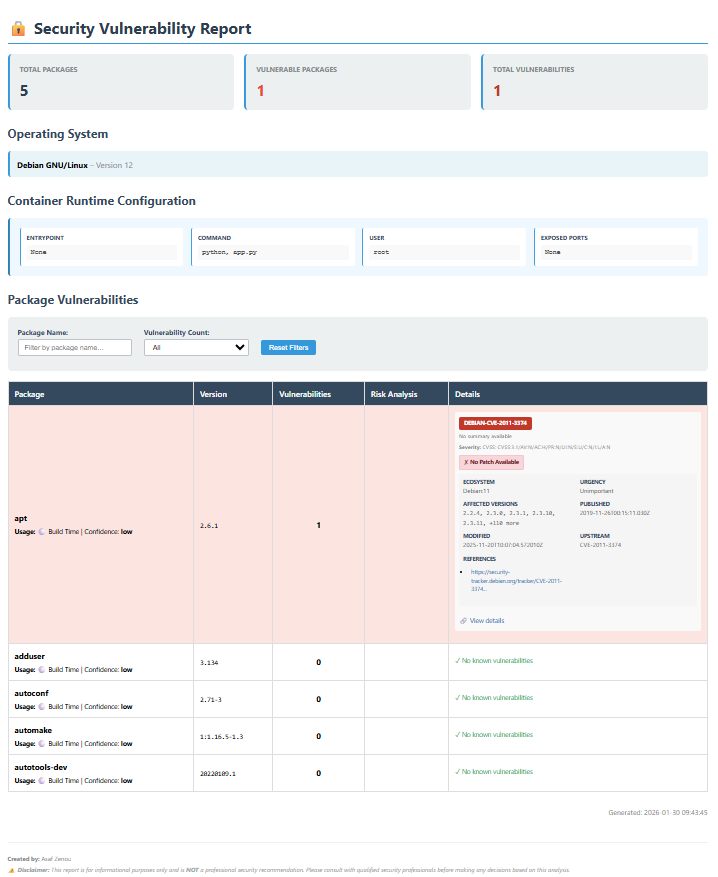

# dockerscan

A comprehensive Docker image scanner that detects OS information, scans packages, identifies vulnerabilities, and generates detailed reports.

## Installation

```bash
pip install -e .
```

## Usage

```bash
dockerscan scan <image_name>
```

Example:
```bash
dockerscan scan ubuntu:20.04
```

## Output

After scanning completes, dockerscan generates a comprehensive **vulnerability report** that is automatically opened in your default browser. The report includes:

- **Summary Dashboard** - Total packages, vulnerable packages, and vulnerability count
- **OS Information** - Detected operating system and version
- **Runtime Configuration** - Container entrypoint, command, user, and exposed ports
- **Package Vulnerabilities Table** with:
  - Package name and version
  - Vulnerability count
  - Risk analysis and severity badges
  - CVE details with CVSS scores
  - Patch status and fix information
  - References and upstream data
- **Interactive Filtering** - Filter by package name or vulnerability count
- **Timestamp** - Report generation date and time

The HTML reports are saved in: `html_reports/<OS_Name>_<Version>_<Timestamp>/vulnerability_report.html`

### Example Report Preview

Here's what the vulnerability report looks like in your browser:



## What it does

1. Saves the Docker image using `docker save`
2. Extracts the image tar archive
3. Reconstructs the merged filesystem from Docker layers
4. Reads `/etc/os-release` from the filesystem
5. Prints the detected OS name and version

## Requirements

- Python 3.11+
- Docker installed and running
- The Docker image must exist locally or be pullable

## Technologies & APIs

### Core Technologies

- **Python 3.11+** - Primary programming language
- **Docker desktop** - For saving and managing Docker images
- **requests** - HTTP library for API calls

### External APIs & Services

- **OSV.dev API** (`https://api.osv.dev/v1/query`) - Open Source Vulnerability database for querying known vulnerabilities in packages
  - Supports multiple ecosystems: Debian, Alpine, Red Hat
  - Provides detailed CVE information and patch status

### Project Architecture

**Key Components:**

1. **Image Scanner** (`dockerscan/image_scanner/`)
   - Extracts Docker images and reconstructs filesystem layers
   - Detects OS information from `/etc/os-release`
   - Scans for installed packages using OS-specific parsers

2. **Package Parsers** (`dockerscan/image_scanner/parsers/`)
   - `dpkg.py` - Debian/Ubuntu package parsing
   - `rpm.py` - RedHat/CentOS/Fedora package parsing
   - `apk.py` - Alpine Linux package parsing

3. **Vulnerability Enrichment** (`dockerscan/data_packagers_checker/`)
   - Queries OSV.dev API for each detected package
   - Enriches packages with vulnerability data
   - Provides risk assessment and recommendations

4. **Reports** (`dockerscan/reports/`)
   - Generates HTML vulnerability reports
   - Includes severity classification (High, Medium, Low)
   - Provides actionable recommendations

5. **Configuration System** (`dockerscan/config/`)
   - Modular OS configuration support
   - Extensible package manager definitions
   - Centralized logging

### Architecture Diagram
```mermid
graph TD
    A["CLI Entry Point<br/>cli.py"] -->|scan image_name| B["ImageScanService"]
    
    B -->|extract & analyze| C["Filesystem<br/>filesystem.py"]
    B -->|detect OS| D["OSDetector<br/>os_detector.py"]
    B -->|scan packages| E["PackageScanner<br/>package_scanner.py"]
    
    C -->|save and extract| F["Docker Image"]
    C -->|merge layers| G["Merged Filesystem"]
    
    D -->|read /etc/os-release| H["OS Configs Registry<br/>os_configs.py"]
    H -->|Factory Pattern| I["DebianConfig<br/>AlpineConfig<br/>RHELConfig"]
    
    E -->|Strategy Pattern| J["Package Parsers"]
    J -->|dpkg| K["dpkg.py<br/>Debian/Ubuntu"]
    J -->|apk| L["apk.py<br/>Alpine"]
    J -->|rpm| M["rpm.py<br/>RHEL/CentOS"]
    
    E -->|analyze usage| N["PackageUsage<br/>package_usage.py"]
    N -->|get context| O["RuntimeContext<br/>runtime_context.py"]
    
    B -->|returns data| P["VulnerabilityEnrichmentService<br/>vulnerability_enrichment_service.py"]
    
    P -->|query vulnerabilities| Q["OSV Client<br/>osv_client.py"]
    Q -->|HTTP API| R["OSV.dev API<br/>api.osv.dev/v1/query"]
    
    P -->|enrich data| S["Enriched Package Data<br/>analysis + vulnerabilities"]
    
    S -->|generate report| T["HTML Report Generator<br/>html_output.py"]
    
    T -->|output| U["HTML Report<br/>vulnerability_report.html"]
    
    U -->|open browser| V["Web Browser<br/>webbrowser.open"]
    
    W["Logger<br/>Singleton Pattern"] -.->|logs all| B
    W -.->|logs all| P
    W -.->|logs all| T
    
    style A fill:#3498db,stroke:#2c3e50,color:#fff
    style B fill:#e74c3c,stroke:#2c3e50,color:#fff
    style P fill:#e74c3c,stroke:#2c3e50,color:#fff
    style T fill:#e74c3c,stroke:#2c3e50,color:#fff
    style H fill:#27ae60,stroke:#2c3e50,color:#fff
    style J fill:#27ae60,stroke:#2c3e50,color:#fff
    style Q fill:#f39c12,stroke:#2c3e50,color:#fff
    style R fill:#9b59b6,stroke:#2c3e50,color:#fff
    style V fill:#16a085,stroke:#2c3e50,color:#fff
```


This diagram visualizes the complete scanning workflow and shows how all components interact:
- **Blue**: Entry point (CLI)
- **Red**: Main services (scanning, enrichment, reporting)
- **Green**: Configuration & strategy patterns
- **Orange**: API client
- **Purple**: External OSV.dev API
- **Teal**: Output browser

## Design Patterns

This project leverages several established design patterns to maintain clean, modular, and extensible code:

### 1. **Strategy Pattern**
Multiple package parsing strategies (dpkg, rpm, apk) allow different OS package managers to be swapped at runtime without changing the scanning logic.

### 2. **Factory Pattern**
The `OS_CONFIGS` registry in `dockerscan/config/os_configs.py` centralizes OS object creation, allowing new distributions to be registered and instantiated dynamically.

### 3. **Singleton Pattern**
The logger in `dockerscan/config/logger.py` ensures a single, globally-accessible logging instance throughout the application lifecycle.

### 4. **Registry/Configuration Pattern**
`OSConfigBase` provides an extensible template for OS configurations, allowing new distributions to inherit and register themselves without modifying core scanning code.

### 5. **Service Pattern**
`ImageScanService` and `VulnerabilityEnrichmentService` encapsulate complex business logic (scanning, enrichment) and coordinate interactions between multiple components.

### 6. **Adapter Pattern**
`OSDetector` adapts different `/etc/os-release` formats across distributions into a unified OS detection interface.

### 7. **Chain of Responsibility Pattern**
The scanning workflow sequentially processes: extract image → detect OS → scan packages → enrich vulnerabilities, passing results through each stage.

These patterns make dockerscan highly maintainable and allow you to add support for new operating systems with minimal code changes.


## Adding Support for New Linux Operating Systems

This guide explains how to add support for a new Linux distribution to dockerscan.

### Overview of the Architecture

The dockerscan project detects OS information and scans packages from Docker images. The OS detection system is modular and extensible:

- **OS Configurations** (`dockerscan/config/`) - Define OS metadata and detection methods
- **Package Parsers** (`dockerscan/image_scanner/parsers/`) - Extract packages from OS-specific formats
- **OS Detector** (`dockerscan/image_scanner/os_detector.py`) - Identifies the OS from image filesystem

### Step-by-Step Guide

#### Step 1: Create OS Configuration File

Create a new file in `dockerscan/config/` for your OS. Example for Fedora:

**File**: `dockerscan/config/os_fedora.py`

```python
from dockerscan.config.os_config_base import OSConfigBase

class FedoraConfig(OSConfigBase):
    def __init__(self):
        super().__init__(
            os_name="Fedora",
            os_version="39",
            package_manager="dnf",
            detection_files=["/etc/os-release", "/etc/fedora-release"]
        )
```

**Parameters:**
- `os_name`: Human-readable OS name
- `os_version`: Default version (can be overridden by detection)
- `package_manager`: Package manager type (dnf, apt, apk, yum, etc.)
- `detection_files`: List of files to check for OS identification

#### Step 2: Register OS in Configuration Registry

Update `dockerscan/config/os_configs.py` to register your new OS:

```python
from dockerscan.config.os_fedora import FedoraConfig

OS_CONFIGS = {
    "debian": DebianConfig(),
    "ubuntu": UbuntuConfig(),
    "alpine": AlpineConfig(),
    "rhel": RHELConfig(),
    "fedora": FedoraConfig(),  # Add this line
}
```

#### Step 3: Create or Reuse Package Parser

Package parsers extract installed packages from OS-specific formats.

**If your OS uses an existing package manager format**, reuse the parser:
- **apt-based systems** (Ubuntu, Debian) → Use `dockerscan/image_scanner/parsers/dpkg.py`
- **rpm-based systems** (RHEL, CentOS, Fedora) → Use `dockerscan/image_scanner/parsers/rpm.py`
- **apk-based systems** (Alpine) → Use `dockerscan/image_scanner/parsers/apk.py`

**If your OS uses a unique package format**, create a new parser:

**File**: `dockerscan/image_scanner/parsers/myos.py`

```python
class MyOSPackageParser:
    @staticmethod
    def parse(filesystem_dir):
        """
        Parse packages from the filesystem.
        
        Args:
            filesystem_dir: Path to the extracted filesystem
            
        Returns:
            List of dicts with 'name' and 'version' keys
        """
        packages = []
        # Your custom parsing logic here
        return packages
```

#### Step 4: Update Package Configuration (Optional)

If your OS has specific package metadata, update `dockerscan/config/os_packages.py`:

```python
OS_PACKAGE_CONFIGS = {
    "fedora": {
        "package_manager": "dnf",
        "parser": "rpm",
        "special_packages": [],
    },
}
```

#### Step 5: Verify OS Detection

Check that `dockerscan/image_scanner/os_detector.py` correctly identifies your OS by reading `/etc/os-release`:

```python
def detect_os_from_release_file(filesystem_dir):
    """Reads /etc/os-release to identify OS"""
    # Should automatically detect your OS if it follows standard format
```

Most modern Linux distributions follow the `/etc/os-release` standard, so no changes needed.

### File Checklist

- [ ] Created `dockerscan/config/os_myos.py` with OS configuration
- [ ] Registered OS in `dockerscan/config/os_configs.py`
- [ ] Created or identified appropriate parser in `dockerscan/image_scanner/parsers/`
- [ ] (Optional) Updated `dockerscan/config/os_packages.py` with OS-specific metadata
- [ ] Verified OS detection in `dockerscan/image_scanner/os_detector.py`

### Example: Adding Ubuntu 24.04 Support

1. **Create config** (`dockerscan/config/os_ubuntu.py`):
```python
from dockerscan.config.os_config_base import OSConfigBase

class UbuntuConfig(OSConfigBase):
    def __init__(self):
        super().__init__(
            os_name="Ubuntu",
            os_version="24.04",
            package_manager="apt",
            detection_files=["/etc/os-release", "/etc/lsb-release"]
        )
```

2. **Register** in `dockerscan/config/os_configs.py`:
```python
"ubuntu": UbuntuConfig(),
```

3. **Use existing parser**: Reuse `dockerscan/image_scanner/parsers/dpkg.py`

4. **Done!** The scanner now supports Ubuntu 24.04

### Supported Operating Systems

- Alpine Linux
- Debian GNU/Linux
- Red Hat Enterprise Linux (RHEL)
- Ubuntu (via dpkg/Debian parser)

### Troubleshooting

**Q: My OS is not being detected**
- Ensure the OS follows the `/etc/os-release` standard
- Add detection files to your OS config's `detection_files` parameter

**Q: Packages are not being parsed**
- Verify the correct parser is registered for your OS's package manager
- Check that the parser can access the package database location in the extracted filesystem

**Q: I see errors about missing package files**
- Some OSes store packages differently (e.g., in squashfs format)
- Create a custom parser that handles your OS's specific format
